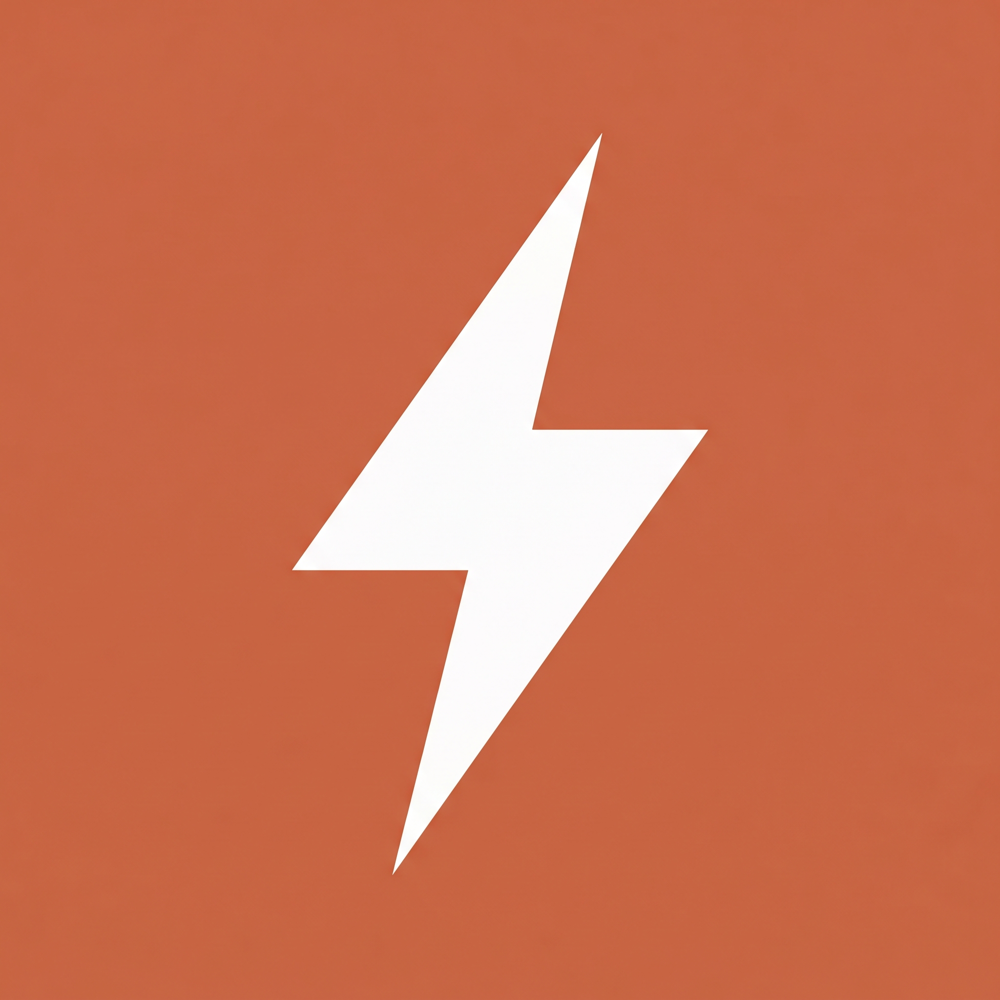

<p align="center">
  
</p>

<h1 align="center">TurboLLM <sub>(product code)</sub></h1>

<!-- Brand assets: web/public/brand/ (icon + wordmark) · in-app mark: web/src/components/Logo.tsx · favicon: web/public/favicon.svg -->

The TurboLLM daemon — a **Node.js + TypeScript** app, shipped as an npm package
(`npx turbollm`), that serves a browser web UI and an OpenAI/Anthropic-compatible API
gateway, and manages any bring-your-own inference engine. Stack decision: ADR-023
(supersedes the earlier Go prototype). Behavior is specified in [`../docs/specs/`](../docs/specs/).

## Requirements

- **Node.js 22 or newer** — the daemon enforces this at startup and exits with a clear
  message if the version is too old. Download: https://nodejs.org

## Quick start

```bash
# run directly without installing (recommended for first try)
npx turbollm

# or install globally, then run
npm install -g turbollm
turbollm
```

The daemon starts, prints the local URL, and opens your browser automatically.
Stop it with **Ctrl+C**.

## Flags

| Flag | Description |
|------|-------------|
| `--port <n>` | Listen on a specific port (default: 6996) |
| `--addr <host:port>` | Full host:port override, e.g. `0.0.0.0:6996` for LAN sharing |
| `--no-open` | Start without opening a browser window |
| `--config <file>` | Path to a custom config file |
| `--help`, `-h` | Show usage and exit |

Examples:

```bash
turbollm                        # start on :6996, open browser
turbollm --port 9000            # listen on port 9000
turbollm --no-open              # start without opening a browser
turbollm --addr 0.0.0.0:6996   # bind to all interfaces (LAN sharing)
```

## Use your local model with Claude Code

TurboLLM serves an Anthropic-compatible API, so coding CLIs like
[Claude Code](https://www.npmjs.com/package/@anthropic-ai/claude-code) can run
against whatever model you have loaded — no cloud key, fully offline. One command
ships with TurboLLM to wire it up:

```bash
turbollm launch claude          # opens Claude Code on your loaded model
```

This requires the daemon to be running with a model loaded (start `turbollm`, then
load a model on the Models screen). It points Claude Code's `ANTHROPIC_BASE_URL` /
`ANTHROPIC_MODEL` at TurboLLM and execs `claude`; any extra args are forwarded
(`turbollm launch claude --help`). If `claude` isn't installed, the command tells
you how (`npm install -g @anthropic-ai/claude-code`). The Developer screen also
shows manual env-var snippets if you prefer to set them yourself.

## Layout

```
turbollm/
  package.json          npm package; bin "turbollm" -> dist/cli.js
  src/
    cli.ts              entrypoint: wiring + graceful shutdown
    server.ts           Hono app: CORS, API, gateway, embedded SPA
    config/             v2 schema + load/save/migrate (spec 01)
    engines/            probe, registry (A1), lifecycle state machine (A2) (spec 03)
    api/routes.ts       /api/v1/* handlers (spec 02)
    gateway/gateway.ts  /v1/* OpenAI pass-through (spec 06)
    deps.ts             shared dependency bundle
    webdist/            built web UI (generated; served by the daemon)
  web/                  React 19 + TS + Tailwind v4 + shadcn frontend (own package.json)
```

## Milestone status

**A1 (engine registry) + A2 (lifecycle state machine) — ✅ ported to TS & verified.**
- [x] config v2 + M0→v2 migration
- [x] engine registry: add/probe (turbo-KV detection), rename, remove, activate, reprobe
- [x] lifecycle state machine: starting→running (health readiness) / stopping / error + logTail
- [x] graceful stop (taskkill→force), port allocation, idle watchdog, engine logs
- [x] `/api/v1/*` (status, engines, lifecycle, logs+SSE) + `/v1` OpenAI gateway
- [x] daemon serves the React UI (shell + Engines screen), SPA deep-links

Build order & specs: [`../docs/specs/README.md`](../docs/specs/README.md)
(A1→A2→A3→A4→B1→A5→B2→B3→C). Next: **A3** (model directories + GGUF discovery, spec 04).

## Develop & run

```bash
# install (once)
npm install               # daemon deps (hono, tsx, tsup)
cd web && npm install && cd ..

# build the web UI (-> src/webdist) then run the daemon in dev (hot TS via tsx)
npm run build:web
npm run start             # or: npm run dev   (watch mode, --no-open recommended)
#   open http://127.0.0.1:6996   ·   curl http://127.0.0.1:6996/api/v1/status

# production bundle (single dist/cli.js with deps bundled)
npm run build             # tsc --noEmit + tsup
node dist/cli.js --port 6996
```

Frontend hot-reload: `cd web && npm run dev` (proxies /api, /v1 to the daemon on :6996).

## Toolchain

Node 25 / npm 11. (Go 1.26.4 is still installed but no longer used — ADR-023.)
Unsigned local runs may be flagged by Windows Defender; production releases must be
code-signed. Do not create dummy `.exe` files.
